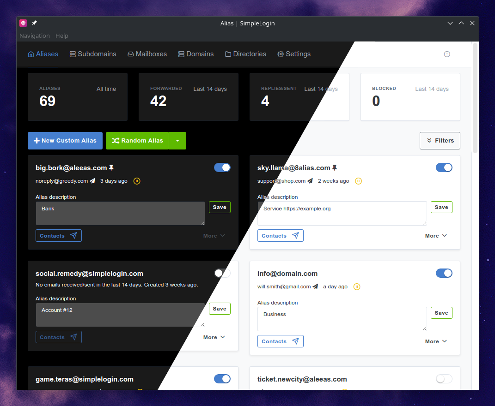
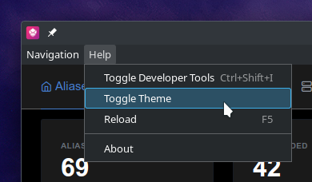
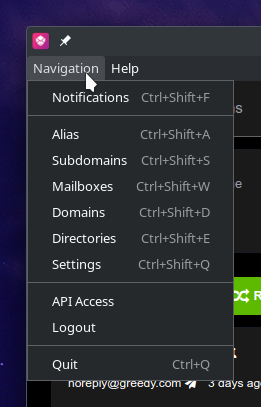

<div align="center"> </div>

<h1 align="center">SimpleLogin Desktop</h1>

An unofficial desktop application embedding the SimpleLogin web-app using [Electron](https://github.com/electron/electron)

> [SimpleLogin](https://simplelogin.io) is an [open source](https://github.com/simple-login) email alias solution to protect your email address.

<details>
<summary style="font-size: large;">Preview</summary>

<table>
<colgroup>
<col style="width: 70%">
<col style="width: 30%">
</colgroup>
<tbody>
  <tr>
    <td></td>
    <td></td>
  </tr>
</tbody>
</table>
</details>
<br>

## Disclaimer

- This project is not affiliated with SimpleLogin, SimpleLogin SAS or Proton AG
- Simple Login® is a registered trademark of Proton AG #97351073

## Features
- Dark and Lightmode
- Keyboard Shortcuts
- Removed Analytics
- Desktop Notifications

## Download

1. Go to the latest [Release](https://github.com/hyperacuity/simplelogin-desktop/releases/latest)

2. Choose a packaging format from the list below
<div style="margin-left: 40px;">

| OS      	| Format    	| Updating   	| Arch      | Type        	|
|---------	|-----------	|-----------	|---------	|-------------	|
| Linux   	| .AppImage 	| yes       	| x64     	| Executable[1]	|
| Linux   	| .tar.gz    	| no        	| x64     	| Standalone  	|
| Windows 	| .exe      	| yes       	| x64/x32 	| Installer    	|
| Windows 	| .zip      	| no        	| x64     	| Standalone  	|

[1] automatic desktop-integration using e.g. this [launcher](https://github.com/TheAssassin/AppImageLauncher) 
</div>

3. Click matching filename to download

## Building
<details>
<summary>using Linux</summary>

0. Install dependencies
```
bash >= 5.2.15 
git  >= 2.39.2
node >= 18.12.1
yarn >= 3.3.1
```
1. Clone repository\
`git clone https://github.com/hyperacuity/simplelogin-desktop.git`
2. Change directory\
`cd ./simplelogin-desktop`

#### for Linux:
3. Run with\
`yarn build`

#### for Windows:

3. [Docker](https://www.docker.com/) is required. [Install](https://docs.docker.com/engine/install/#server) it and see [this](https://www.electron.build/multi-platform-build.html#docker) page for more information

4. Start container with
```bash
docker run --rm -ti \
 --env-file <(env | grep -iE 'DEBUG|NODE_|ELECTRON_|YARN_|NPM_|CI|CIRCLE|TRAVIS_TAG|TRAVIS|TRAVIS_REPO_|TRAVIS_BUILD_|TRAVIS_BRANCH|TRAVIS_PULL_REQUEST_|APPVEYOR_|CSC_|GH_|GITHUB_|BT_|AWS_|STRIP|BUILD_') \
 --env ELECTRON_CACHE="/root/.cache/electron" \
 --env ELECTRON_BUILDER_CACHE="/root/.cache/electron-builder" \
 -v ${PWD}:/project \
 -v ${PWD##*/}-node-modules:/project/node_modules \
 -v ~/.cache/electron:/root/.cache/electron \
 -v ~/.cache/electron-builder:/root/.cache/electron-builder \
 electronuserland/builder:wine
```
5. Run with\
`yarn build-win`

</details>
<br/>

## Contributing

- [Issues]() are appreciated 
- Communicate with me if you want to improve something

## License

[GPLv3](./license.md)

